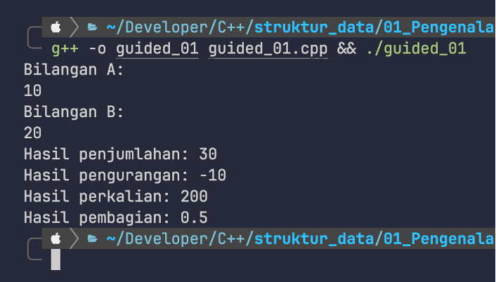
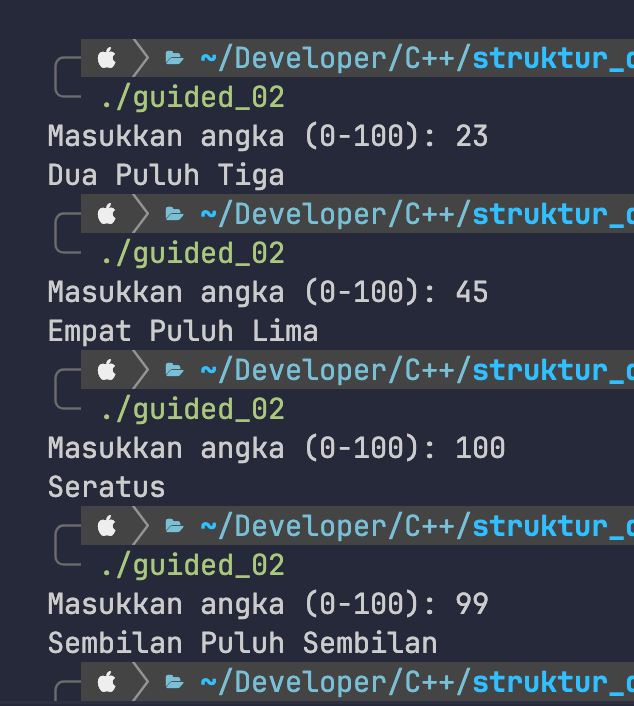
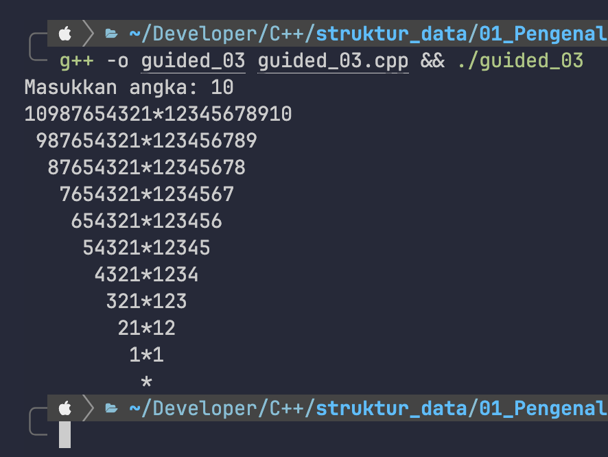

# Laporan Tugas Pendahuluan

## No. 1
bilA = 10 <br>
bilB = 20

```c++
#include <iostream>
#include <stdio.h>
using namespace std;

int main()
{
    // Nomor 1
    float bilA;

    float bilB;

    cout << "Bilangan A: " << endl;
    cin >> bilA;

    cout << "Bilangan B: " << endl;
    cin >> bilB;

    // Hasil penjumlahan
    cout << "Hasil penjumlahan: " << bilA + bilB << endl;

    // Hasil pengurangan
    cout << "Hasil pengurangan: " << bilA - bilB << endl;

    // Hasil perkalian
    cout << "Hasil perkalian: " << bilA * bilB << endl;

    // Hasil pembagian
    cout << "Hasil pembagian: " << bilA / bilB << endl;

    return 0;
}
```

Output:


## No. 2
```c++
#include <iostream>
#include <stdio.h>
using namespace std;

int main()
{
    // Nomor 2
    string angka[] = {"Nol", "Satu", "Dua", "Tiga", "Empat", "Lima", "Enam", "Tujuh", "Delapan", "Sembilan", "Sepuluh",
                      "Sebelas", "Dua Belas", "Tiga Belas", "Empat Belas", "Lima Belas", "Enam Belas", "Tujuh Belas", "Delapan Belas", "Sembilan Belas", "Dua Puluh",
                      "Tiga Puluh", "Empat Puluh", "Lima Puluh", "Enam Puluh", "Tujuh Puluh", "Delapan Puluh", "Sembilan Puluh"};

    string seratus = "Seratus";

    int num;
    cout << "Masukkan angka (0-100): ";
    cin >> num;

    if (num < 0 || num > 100)
    {
        cout << "Angka harus antara 0 dan 100." << endl;
    }
    else if (num <= 20)
    {
        cout << angka[num] << endl;
    }
    else if (num < 100)
    {
        int puluhan = num / 10;
        int satuan = num % 10;
        if (satuan == 0)
        {
            cout << angka[18 + puluhan] << endl;
        }
        else
        {
            cout << angka[18 + puluhan] << " " << angka[satuan] << endl;
        }
    }
    else
    {
        cout << seratus << endl;
    }

    return 0;
}
```

Output:


## No. 3
```c++
#include <iostream>
using namespace std;

int main()
{
    int n;
    cout << "Masukkan angka: ";
    cin >> n;
    for (int i = n; i > 0; i--)
    {
        for (int s = 0; s < n - i; s++)
        {
            cout << " ";
        }
        for (int j = i; j > 0; j--)
        {
            cout << j;
        }
        cout << "*";
        for (int k = 1; k <= i; k++)
        {
            cout << k;
        }
        cout << endl;
    }
    for (int s = 0; s < n; s++)
    {
        cout << " ";
    }
    cout << "*" << endl;
    return 0;
}
```

Output:
